# ProyectoEntornoCliente2026

Proyecto grupal de desarrollo de una **plataforma empresarial modular**, similar a herramientas como ERP/CRM/RRHH, organizada en **múltiples módulos integrados** (CORE, RRHH, CRM, BPM, ERP, ALM, Soporte y BI).

Durante el **Sprint 2.1** el equipo se centra en la **definición, organización y documentación del producto**, estableciendo:
- La visión global del sistema y sus módulos
- El modelo de datos común y las relaciones entre entidades
- Las integraciones entre módulos
- Un diseño de API a alto nivel
- La organización del equipo y la metodología de trabajo

En este sprint **no se desarrolla código funcional**, priorizando una base sólida y coherente antes de comenzar la implementación.

---
# Organización del equipo y planificación del trabajo

## Frontend
- Visión general del Frontend + planificación de la base: José Luis, Pablo y Víctor.
- Primera elección de colores, tipografía, distribución: José Luis, Pablo y Víctor.
- Primeros bocetos, prototipos y apartado visual: Victor.
- Documentación de módulos basados en el backend: José Luis y Pablo.

## Backend
- Visión general del Backend + planifición de la base: Javier, Paco, Bartolome, Hernán, Alberto y David.
- División de modulos para documentación:
    - Alberto: CORE + Coordinacion de Arquitectura
    - Bartolome: RRHH + Coordinacion de Modelo de Datos
    - Paco: CRM + Coordinacion de APIs
    - Javier: ALM + Coordinacion de Integraciones
    - Hernan: BPM + ERP
    - David: Soporte/Tickets + BI

## Coordinación

- Coordinador general + Front: José Luis
- Coordinador de back: Javier

---

# Guia básica Trello  
Azul para Frontend
Morado para Backend
Rojo para Críticas/correciones
Verde para Base de Datos

**Nomenclatura**  
Un ejemplo de ticket puede ser FE - "Título de ticket".
Crear, seleccionar ticket, añadir etiqueta de color y añadir breve descripción.

**Progreso del ticket**  
  

- TO DO -> Listado completo con todos los tickets pendientes.
- PROGRESS -> Ticket que se está realizando en ese momento (solo un ticket por persona en PROGRESS).
- ON HOLD -> Listado de Tickets que están bloqueados por algún motivo, por ejemplo que tu ticket dependa de otro ticket.
- UNDER REVIEW -> Tickets que se ha realizado el contenido y se está revisando que funciona correctamente.
- DONE -> Cuando se ha dado por valido el funcionamiento y finalización del ticket.

---

# Idea base frontend

## Tipografía
- Fuente principal: Inter (Google Fonts)
- Alternativa: Roboto, Open Sans
- Tamaños: Títulos 24-32px, Texto 14-16px

## Componentes de UI principales
- Sidebar con iconos para navegación rápida
- Tablas para listados
- Formularios simples (inputs, selects, datepickers)
- Cards para resúmenes/detalles
- Botones azules (primario), grises (secundario)

## Pantallas mínimas por módulo
- CORE: Dashboard, Login, Lista Usuarios, Detalle Usuario, Alta/Edición Usuario, Lista Empresas, Detalle Empresa, Alta/Edición Empresa, Roles
- RRHH: Lista Empleados, Detalle Empleado, Alta/Edición Empleado, Vacaciones/ausencias (calendario, solicitud)
- CRM: Lista Clientes, Detalle Cliente, Alta/Edición Cliente, Oportunidades/interacciones
- BPM: Lista Procesos, Detalle Proceso, Crear/Edición, Seguimiento/Aprobación
- ERP: Lista Facturas, Detalle Factura, Crear/Edición Factura, Lista Productos, Detalle Producto
- ALM: Lista Proyectos, Detalle Proyecto, Crear/Edición Proyecto, Lista Tareas
- Soporte: Lista Tickets, Detalle Ticket, Crear/Edición Ticket, Chat
- BI: Dashboard, Vista informe

> *Total aproximado para MVP: 32-38 pantallas.*

## Paleta de colores provisional

*Imagen de la paleta de colores provisional*

Colores:

- #5AC8DB
- #5A76DB
- #5A9FDB
- #5ADBC4
- #675ADB
- #7CB1DF

## Diagrama de flujo provisional

```mermaid
flowchart TD
    A[Login] --> B[Dashboard]

    %% Desde dashboard, menú de navegación
    B --> C1[CORE]
    B --> C2[RRHH]
    B --> C3[CRM]
    B --> C4[BPM]
    B --> C5[ERP]
    B --> C6[ALM]
    B --> C7[Soporte]
    B --> C8[BI]
    B --> D[Perfil de usuario]
    B --> E[Logout]

    %% Estructura genérica de módulo
    C1 --> CORE_List[Listado Usuarios/Empresas/Roles]
    CORE_List --> CORE_Det[Detalle Usuario/Empresa/Rol]
    CORE_List --> CORE_New[Alta Usuario/Empresa/Rol]
    CORE_Det --> CORE_Edit[Editar Usuario/Empresa/Rol]
    CORE_Edit --> CORE_List
    CORE_New --> CORE_List

    C2 --> RRHH_List[Listado Empleados]
    RRHH_List --> RRHH_Det[Detalle Empleado]
    RRHH_List --> RRHH_New[Alta Empleado]
    RRHH_Det --> RRHH_Edit[Editar Empleado]
    RRHH_Edit --> RRHH_List
    RRHH_New --> RRHH_List
    RRHH_Det --> RRHH_Vacaciones[Vacaciones/Ausencias]

    C3 --> CRM_List[Listado Clientes/Contactos]
    CRM_List --> CRM_Det[Detalle Cliente/Contacto]
    CRM_List --> CRM_New[Alta Cliente/Contacto]
    CRM_Det --> CRM_Edit[Editar Cliente/Contacto]
    CRM_Edit --> CRM_List
    CRM_New --> CRM_List
    CRM_Det --> CRM_Opp[Oportunidades]
    CRM_Opp --> CRM_Int[Interacciones]

    C4 --> BPM_List[Listado Procesos]
    BPM_List --> BPM_Det[Detalle/Instancia Proceso]
    BPM_List --> BPM_New[Alta Proceso]
    BPM_Det --> BPM_Edit[Editar Proceso]
    BPM_Edit --> BPM_List
    BPM_New --> BPM_List
    BPM_Det --> BPM_Apr[Seguimiento/Aprobación]

    C5 --> ERP_ListF[Listado Facturas]
    C5 --> ERP_ListP[Listado Productos]
    ERP_ListF --> ERP_DetF[Detalle Factura]
    ERP_ListF --> ERP_NewF[Alta Factura]
    ERP_DetF --> ERP_EditF[Editar Factura]
    ERP_EditF --> ERP_ListF
    ERP_NewF --> ERP_ListF
    ERP_ListP --> ERP_DetP[Detalle Producto]
    ERP_ListP --> ERP_NewP[Alta Producto]
    ERP_DetP --> ERP_EditP[Editar Producto]
    ERP_EditP --> ERP_ListP
    ERP_NewP --> ERP_ListP

    C6 --> ALM_ListP[Listado Proyectos]
    ALM_ListP --> ALM_DetP[Detalle Proyecto]
    ALM_ListP --> ALM_NewP[Alta Proyecto]
    ALM_DetP --> ALM_EditP[Editar Proyecto]
    ALM_EditP --> ALM_ListP
    ALM_NewP --> ALM_ListP
    ALM_DetP --> ALM_ListT[Listado Tareas]
    ALM_ListT --> ALM_DetT[Detalle Tarea]
    ALM_ListT --> ALM_NewT[Alta Tarea]
    ALM_DetT --> ALM_EditT[Editar Tarea]
    ALM_EditT --> ALM_ListT
    ALM_NewT --> ALM_ListT

    C7 --> Sop_List[Listado Tickets]
    Sop_List --> Sop_Det[Detalle Ticket]
    Sop_List --> Sop_New[Alta Ticket]
    Sop_Det --> Sop_Edit[Editar Ticket]
    Sop_Edit --> Sop_List
    Sop_New --> Sop_List
    Sop_Det --> Sop_Conv[Conversación Ticket]

    C8 --> BI_Dash[Dashboard BI]
    BI_Dash --> BI_List[Listado Informes]
    BI_List --> BI_Det[Detalle Informe]
    BI_Det --> BI_List
```

---

