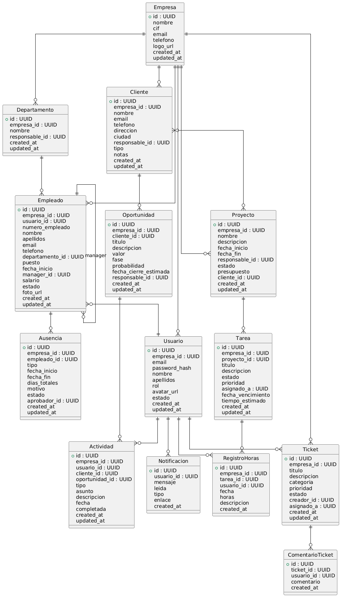

# MODELADO PROVISIONAL DE BBDD

##  CORE

### **Empresas**

Entidad raíz del sistema (multi-tenant).

* **id**: identificador único
* **nombre**: nombre comercial
* **cif**: identificador fiscal
* **email**
* **telefono**
* **logo_url**
* **created_at**
* **updated_at**

---

### **Usuarios**

Usuarios con acceso a la plataforma.

* **id**
* **empresa_id** → Empresa propietaria
* **email** (único)
* **password_hash**
* **nombre**
* **apellidos**
* **rol**: admin | manager | empleado
* **avatar_url**
* **estado**: activo | inactivo
* **created_at**
* **updated_at**

Relaciones:

* Pertenece a una empresa
* Puede ser responsable de departamentos, clientes, proyectos, etc.

---

### **Departamentos**

Estructura organizativa interna.

* **id**
* **empresa_id**
* **nombre**
* **responsable_id** → Usuario responsable
* **created_at**
* **updated_at**

---

### **Notificaciones**

Sistema interno de avisos a usuarios.

* **id**
* **usuario_id**
* **mensaje**
* **leida** (true / false)
* **tipo**: info | warning | success
* **enlace**
* **created_at**

---

##  MÓDULO RRHH

### **Empleados**

Registro laboral (puede existir sin usuario).

* **id**
* **empresa_id**
* **usuario_id** (opcional)
* **numero_empleado**
* **nombre**
* **apellidos**
* **email**
* **telefono**
* **departamento_id**
* **puesto**
* **fecha_inicio**
* **manager_id** → otro empleado
* **salario**
* **estado**: activo | baja
* **foto_url**
* **created_at**
* **updated_at**

---

### **Ausencias**

Gestión de vacaciones y permisos.

* **id**
* **empresa_id**
* **empleado_id**
* **tipo**: vacaciones | enfermedad | permiso
* **fecha_inicio**
* **fecha_fin**
* **dias_totales**
* **motivo**
* **estado**: pendiente | aprobada | rechazada
* **aprobador_id** → usuario
* **created_at**
* **updated_at**

---

##  MÓDULO CRM

### **Clientes**

Leads y clientes finales.

* **id**
* **empresa_id**
* **nombre**
* **email**
* **telefono**
* **direccion**
* **ciudad**
* **responsable_id** → usuario asignado
* **tipo**: lead | cliente
* **notas**
* **created_at**
* **updated_at**

---

### **Oportunidades**

Pipeline comercial.

* **id**
* **empresa_id**
* **cliente_id**
* **titulo**
* **descripcion**
* **valor**
* **fase**: contacto | propuesta | negociacion | ganada | perdida
* **probabilidad**
* **fecha_cierre_estimada**
* **responsable_id**
* **created_at**
* **updated_at**

---

### **Actividades**

Historial de interacciones comerciales.

* **id**
* **empresa_id**
* **usuario_id**
* **cliente_id** (opcional)
* **oportunidad_id** (opcional)
* **tipo**: llamada | email | reunion | nota
* **asunto**
* **descripcion**
* **fecha**
* **completada**
* **created_at**
* **updated_at**

---

##  MÓDULO ALM / PROYECTOS

### **Proyectos**

Gestión de proyectos internos o para clientes.

* **id**
* **empresa_id**
* **nombre**
* **descripcion**
* **fecha_inicio**
* **fecha_fin**
* **responsable_id**
* **estado**: planificacion | en_curso | pausado | completado
* **presupuesto**
* **cliente_id** (opcional)
* **created_at**
* **updated_at**

---

### **Tareas**

Unidades de trabajo dentro de proyectos.

* **id**
* **empresa_id**
* **proyecto_id**
* **titulo**
* **descripcion**
* **estado**: pendiente | en_progreso | completada
* **prioridad**: baja | media | alta
* **asignado_a** → usuario
* **fecha_vencimiento**
* **tiempo_estimado** (horas)
* **created_at**
* **updated_at**

---

### **Registro de Horas**

Timesheet por tarea.

* **id**
* **empresa_id**
* **tarea_id**
* **usuario_id**
* **fecha**
* **horas**
* **descripcion**
* **created_at**

---

##  MÓDULO SOPORTE

### **Tickets**

Gestión de incidencias y soporte.

* **id**
* **empresa_id**
* **titulo**
* **descripcion**
* **categoria**: tecnico | facturacion | otro
* **prioridad**: baja | media | alta | urgente
* **estado**: abierto | en_progreso | resuelto | cerrado
* **creador_id**
* **asignado_a**
* **created_at**
* **updated_at**

---

### **Comentarios de Ticket**

Conversación asociada a un ticket.

* **id**
* **ticket_id**
* **usuario_id**
* **comentario**
* **created_at**

---

##  MÓDULO BPM

### **Procesos**

Definición funcional y técnica de cada flujo.

* **id**
* **empresa_id**
* **codigo** (único por empresa)
* **nombre**
* **descripcion**
* **version_publicada_id** → versión activa
* **estado**: borrador | publicado | archivado
* **created_at**
* **updated_at**

---

### **Versiones de Proceso**

Permite mantener histórico y despliegues controlados.

* **id**
* **proceso_id**
* **numero_version**
* **definicion_bpmn** (JSON/BPMN)
* **calendario_id** (opcional)
* **publicada_por** → usuario
* **created_at**
* **updated_at**

---

### **Instancias de Proceso**

Ejecuciones en tiempo real.

* **id**
* **empresa_id**
* **proceso_id**
* **version_id**
* **estado**: activa | pausada | completada | cancelada
* **iniciador_id** → usuario/servicio
* **fecha_inicio**
* **fecha_fin** (opcional)
* **datos_contexto** (JSON)
* **ultimo_evento_at**

---

### **Tareas**

Actividades humanas generadas desde las instancias.

* **id**
* **instancia_id**
* **actividad_id** (referencia al modelo)
* **asignado_a_id** (usuario/rol)
* **estado**: pendiente | en_progreso | completada | vencida
* **prioridad**: baja | media | alta | urgente
* **sla_fin**
* **fecha_inicio**
* **fecha_fin**
* **comentarios**

---

### **Formularios**

Metadatos de formularios dinámicos.

* **id**
* **proceso_id**
* **nombre**
* **version**
* **schema_json**
* **es_activo**
* **created_at**
* **updated_at**

---

### **Respuestas de Formulario**

Datos concretos capturados durante la ejecución.

* **id**
* **instancia_id**
* **tarea_id** (opcional)
* **formulario_id**
* **datos_json**
* **completado_por** → usuario
* **created_at**

---

### **Conectores**

Define integraciones reutilizables.

* **id**
* **empresa_id**
* **nombre**
* **tipo**: rest | soap | cola | rpa
* **configuracion_json**
* **credencial_id** (vault)
* **es_activo**
* **created_at**
* **updated_at**

---

### **Logs de Ejecución**

Trazabilidad detallada para auditoría.

* **id**
* **instancia_id**
* **tipo_evento**
* **detalle**
* **actor_id** (usuario/servicio)
* **fecha_evento**

---

##  MÓDULO ERP

### **Cuentas Contables**

Plan contable por empresa.

* **id**
* **empresa_id**
* **codigo**
* **nombre**
* **tipo**: activo | pasivo | patrimonio | ingreso | gasto
* **nivel**
* **es_imputable**
* **created_at**
* **updated_at**

---

### **Asientos Contables**

Libro mayor.

* **id**
* **empresa_id**
* **fecha**
* **descripcion**
* **periodo**
* **estado**: borrador | confirmado | revertido
* **creado_por**
* **created_at**

---

### **Partidas de Asiento**

Detalle debit/credit por cuenta.

* **id**
* **asiento_id**
* **cuenta_id**
* **centro_coste_id** (opcional)
* **proyecto_financiero_id** (opcional)
* **debe**
* **haber**

---

### **Proveedores**

Maestro de abastecimiento.

* **id**
* **empresa_id**
* **nombre_fiscal**
* **cif**
* **email**
* **telefono**
* **direccion**
* **ciudad**
* **estado**: activo | bloqueado
* **created_at**
* **updated_at**

---

### **Órdenes de Compra**

Registro de solicitudes aprobadas.

* **id**
* **empresa_id**
* **proveedor_id**
* **numero**
* **fecha**
* **estado**: borrador | aprobada | recibida | cerrada
* **moneda**
* **total**
* **creado_por**
* **aprobado_por**
* **created_at**
* **updated_at**

---

### **Clientes**

Complementa información CRM con datos fiscales.

* **id**
* **empresa_id**
* **nombre_fiscal**
* **cif**
* **email_facturacion**
* **telefono**
* **direccion**
* **ciudad**
* **condiciones_pago**
* **estado**: activo | bloqueado
* **created_at**
* **updated_at**

---

### **Pedidos de Venta**

Pedidos confirmados listos para entrega/factura.

* **id**
* **empresa_id**
* **cliente_id**
* **numero**
* **fecha**
* **estado**: borrador | confirmado | parcialmente_entregado | completado
* **moneda**
* **total**
* **created_at**
* **updated_at**

---

### **Facturas (Compra/Venta)**

Documentos legales.

* **id**
* **empresa_id**
* **tipo**: compra | venta
* **origen_id** (orden/pedido)
* **cliente_id / proveedor_id**
* **numero**
* **fecha_emision**
* **fecha_vencimiento**
* **estado**: emitida | pagada | vencida | anulada
* **moneda**
* **subtotal**
* **impuestos**
* **total**
* **created_at**
* **updated_at**

---

### **Artículos**

Catálogo de productos/servicios.

* **id**
* **empresa_id**
* **codigo**
* **nombre**
* **tipo**: servicio | producto
* **unidad_medida**
* **precio_base**
* **cuenta_ingreso_id / cuenta_gasto_id**
* **created_at**
* **updated_at**

---

### **Almacenes**

Ubicaciones físicas.

* **id**
* **empresa_id**
* **codigo**
* **nombre**
* **direccion**
* **es_principal**
* **created_at**
* **updated_at**

---

### **Inventario y Movimientos**

Control de existencias y trazabilidad.

* **id**
* **empresa_id**
* **articulo_id**
* **almacen_id**
* **lote** (opcional)
* **tipo_movimiento**: ingreso | salida | ajuste
* **origen** (orden compra, producción, venta, etc.)
* **cantidad**
* **costo_unitario**
* **created_at**

---

### **Órdenes de Producción**

Planificación de fabricación.

* **id**
* **empresa_id**
* **numero**
* **articulo_id**
* **cantidad_planificada**
* **fecha_inicio**
* **fecha_fin_estimada**
* **estado**: planificada | en_proceso | completada | cancelada
* **responsable_id**
* **created_at**
* **updated_at**

---

### **Centros de Coste / Proyectos Financieros**

Estructura para imputación contable.

* **id**
* **empresa_id**
* **codigo**
* **nombre**
* **tipo**: centro_coste | proyecto
* **padre_id** (opcional)
* **estado**: activo | cerrado
* **created_at**
* **updated_at**

---

## 🔗 Relaciones Clave (Resumen)

* Todo pertenece a **Empresa**
* **Usuario ≠ Empleado** (relación opcional)
* CRM ↔ Proyectos (cliente opcional)
* Proyectos → Tareas → Registro de horas
* Soporte completamente integrado con usuarios
* BPM: Procesos → Versiones → Instancias → Tareas/Formularios (referencian usuarios y empresas)
* ERP: Cuentas ↔ Partidas ↔ Asientos; Compras/Ventas ↔ Facturas; Inventario/Producción vinculado a artículos y almacenes

## Diagrama Entidad Relación

